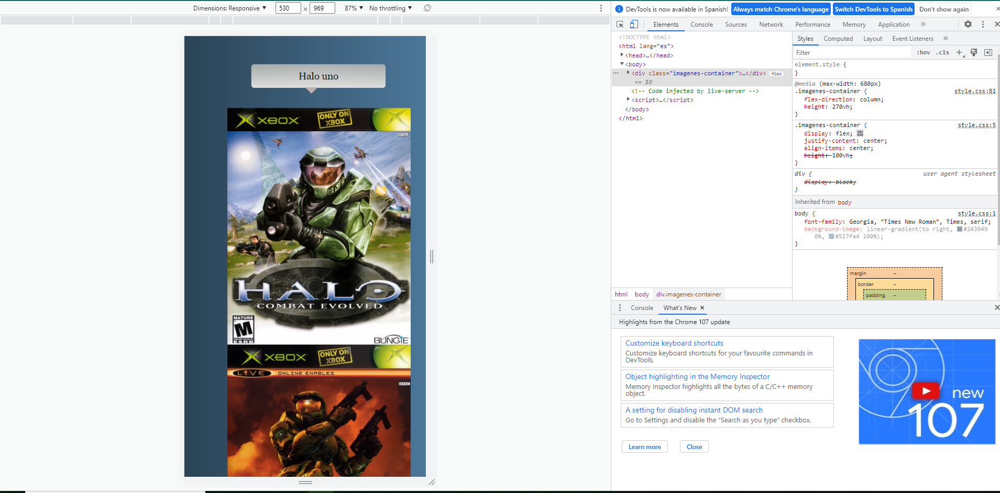

<h1> 
welcome to the responsive 
image gallery
</h1>
<h4> can you see the website here ψ(._. )>
</h4>
<a  href="https://luis-felipe-galery-responsive.netlify.app/" target="_blank" > the website
</a>

<h2>

Now you can see the changes so that the images are responsive and better visualization on different devices 
Animations were also used for greater customization at work

</h2>

<h3>
